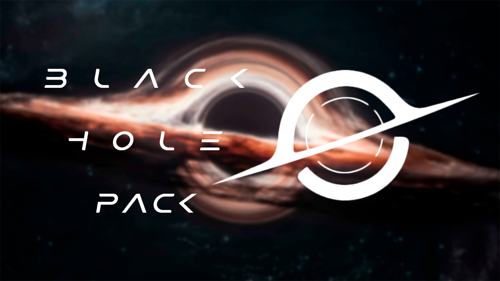

# BlackHole Pack
 Pacote de Desbloqueio para Nintendo Switch

<h2>Composição do Pacote</h2>

<ul>
	<li><i>BOOTLOADER:</i>
		<ul><li>Hekate: Bootloader gráfico personalizado para Nintendo Switch.</li></ul>
	</li>
	<li><i>CUSTOM FIRMWARE:</i>
		<ul><li>Atmosphere: Firmware personalizado para Nintendo Switch.</li></ul>
	</li>
	<li><i>COMPATIBILIDADE:</i>
		<ul>
			<li>SigPatches: Os "Signature Patches" são criados para serem usados em 
			conjunto com o Atmosphere para carregar Homebrews a partir do menu inicial.</li>
		</ul>
	</li>
	<li><i>CONFIGURAÇÔES:</i>
		<ul><li>IniFiles: Arquivos de inicialização MultiBoot e gerenciamento de recursos.</li></ul>
	</li>
</ul>

<h2>Homebrews</h2>

<ul>
	<li>Daybreak:  Atualizador de Firmware para Sistema Switch Customizado; Autor: <a href="https://github.com/Atmosphere-NX">Atmosphere-NX</a></li>
	<li>Reboot to Payload: Inicializador de payload (Erista Only); Autor: <a href="https://github.com/Atmosphere-NX">Atmosphere-NX</a></li>
	<li>USB File Transfer: Inicializador para transferência de arquivos via USB; Autor: <a href="https://github.com/Atmosphere-NX">Atmosphere-NX</a></li>
	<li>DB Installer: Gerenciador de arquivos nativo; Instalador [XCI, NSP, XCZ, NSZ] via [MTP, USB, FTP]; 
	Autor: <a href="https://github.com/rashevskyv">rashevskyv</a></li>
	<li>JKSV: Gerenciador nativo de saves (Info, Copy, Move, Del, Dump, Export, Import, Upload, Download); 
	Autor: <a href="https://github.com/J-D-K">J-D-K</a></li>
	<li>Linkalho: Gerenciador de contas vinculadas para Sistema Switch Customizado (Vincular, Desvincular, Backup, Restore); Autor: <a href="https://github.com/rdmrocha">rrocha</a></li>
	<li>NXThemes Installer: Gerenciador de Temas Customizados (Insatalar, Desinstalar); Autor: <a href="https://github.com/exelix11">exelix11</a></li>
	<li>Themezer-NX: Loja Digital de Temas Customizados; Autor: <a href="https://github.com/suchmememanyskill">suchmememanyskill</a></li>
	<li>duckstation: Emulador nativo de PlayStation 1 para Sistema Switch Customizado; Autor: <a href="https://github.com/RSDuck">RSDuck</a> (Forked from <a href="https://github.com/stenzek">stenzek</a>)</li>
	<li>ppsspp: Emulador nativo de PlayStation Portable para Sistema Switch Customizado; Autor: <a href="https://github.com/m4xw">m4xw</a> (Forked from <a href="https://github.com/hrydgard">hrydgard</a>)</li>
	<li>melonDS: Emulador nativo de Nintendo DS para Sistema Switch Customizado; Autor: <a href="https://github.com/RSDuck">RSDuck</a> (Forked from <a href="https://github.com/Hydr8gon">Hydr8gon</a> 
	- Forked from: <a href="https://github.com/melonDS-emu">melonDS-emu</a>)</li>
</ul>

<h2>Extras</h2>

<ul>
	<li><i>TEMAS</i>
	<ul>
		<li><a href="https://themezer.net/packs/Ephemeral-Dark-Atmosphere-835">Ephemeral Dark Atmosphere</a> ("All Apps" & "Home Menu" screens)</li>
		<li><a href="https://themezer.net/packs/Ephemeral-Light-Atmosphere-836">Ephemeral Light Atmosphere</a> ("All Apps" & "Home Menu" screens)</li>
		<li><a href="https://themezer.net/packs/Yoshis-Island-SNES-837">Yoshis Island [SNES]</a> ("All Apps" & "Home Menu" screens)</li>
		<li><a href="https://themezer.net/packs/Yoshis-New-Island-3DS-838">Yoshis New Island [3DS]</a> ("All Apps" & "Home Menu" screens)</li>
	</ul>
</ul>

<h2>Agradecimentos</h2>
<ul>
	<li><a href="https://github.com/CTCaer/hekate">Hekate e Nyx</a> por CTCaer </li>
	<li><a href="https://github.com/Atmosphere-NX/Atmosphere">Atmosphere e Fusee</a> por Atmosphere-NX </li>
	<li><a href="https://sigmapatches.su/">SigPatches</a> por sigmapatches.su </li>
	<li><a href="https://rentry.co/EristaEmu">IniFiles</a> por rentry.co </li>
</ul>

